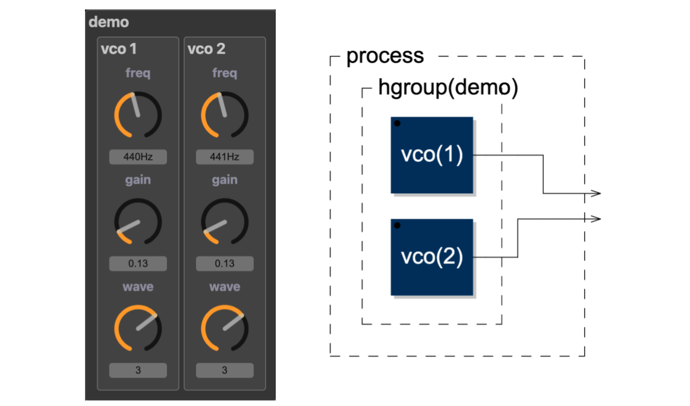
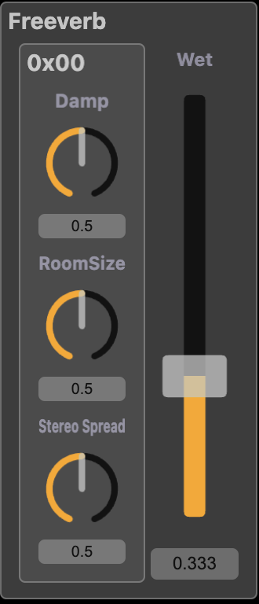
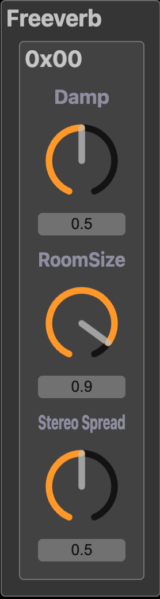
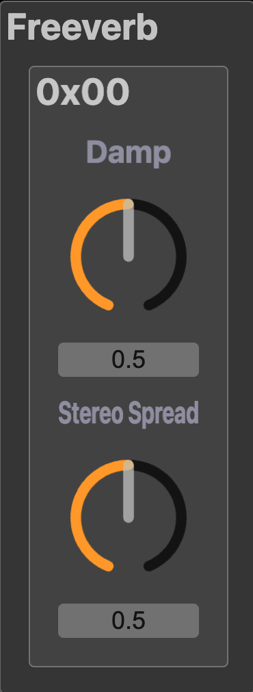
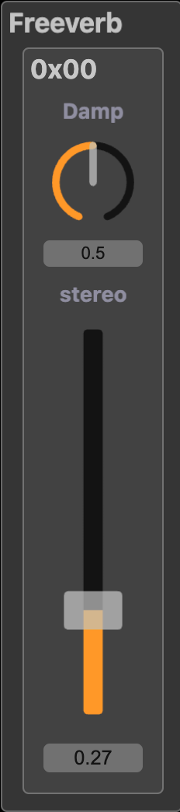
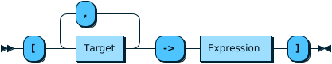
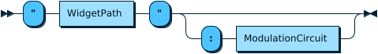
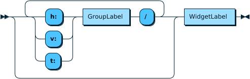

# Introduction

{height=50%}

## Example

```C
mo = library("modular.lib");
process = hgroup("demo", mo.vco(1), mo.vco(2));
```

## Question?

Can I use these VCOs for frequency modulation?


# The answer ...

Not without editing the code (or using Widget Modulation)

## Widget Modulation

- New extension to Faust programming language
- Inspired by modular synthesizers
- Enables "voltage control" style modulation
- Allows parameter modulation without code modification
- Enhances code reuse and customization

## Example

```C
mo = library("modular.lib");
process = hgroup("demo", mo.vco(1)*200  
                       : ["freq":+ -> mo.vco(2)]) 
                      <: _,_;
```

# Reshaping the UI of `dm.freeverb_demo` (1/4).

{ height=50%}

## Example 1: full UI

```faust
import("stdfaust.lib");
process = ba.pulsen(1, 10000) 
        : pm.djembe(60, 0.3, 0.4, 1)  
       <: dm.freeverb_demo;
```

# Reshaping the UI of `dm.freeverb_demo` (2/4).

{ height=50%}

## Example 2: full UI

```faust
import("stdfaust.lib");
process = ba.pulsen(1, 10000) 
        : pm.djembe(60, 0.3, 0.4, 1)  
       <: ["Wet":0.2 -> dm.freeverb_demo];
```

# Reshaping the UI of `dm.freeverb_demo` (3/4).

{ height=50%}

## Example 2: full UI

```faust
import("stdfaust.lib");
process = ba.pulsen(1, 10000) 
        : pm.djembe(60, 0.3, 0.4, 1)  
       <: ["Wet":0.2, "RoomSize":0.9 -> dm.freeverb_demo];
```

# Reshaping the UI of `dm.freeverb_demo` (4/4).

{ height=30%}

## Example 2: full UI

```faust
import("stdfaust.lib");
st = vslider("stereo", 0.5, 0, 1, 0.01);
process = ba.pulsen(1, 10000) 
        : pm.djembe(60, 0.3, 0.4, 1)  
       <: ["Wet":0.2, "RoomSize":0.9, 
	       "Stereo Spread":st -> dm.freeverb_demo];
```

# Widget Modulation: Basic Syntax

## Syntax diagram:


---

# Widget Modulation: Target Syntax

## Syntax diagram:



# Widget Modulation: Widget Path

## Syntax diagram:



# Modulation Circuit

## Binary Circuit (2→1)

- Creates an additional input
- Example: `"Wet":+`

## Unary Circuit (1→1)

- Transforms the widget value, no additional input
- Example: `"Wet":*(lfo(10, 0.5))`

## Constant Circuit (0→1)

- Replaces the widget
- Example: `"Wet":0.75`
- Example: `"Wet":hslider("foo", 0.5, 0, 1, 0.1)`

# Example of (2→1) modulation circuit

## Description

- We assume the modulation signal $m$ is an audio signal.
- When $m$ is 0, the current slider value is used.
- When $m$ is +1, the maximum value of the slider is used.
- When $m$ is -1, the minimum value of the slider is used.

## Implementation

```C
mod(s, m) = s + (h - s) * max(0, m) + (s - l) * min(0, m)
    with {
        l = lowest(s);
        h = highest(s);
    };
```

# Conclusion

## Benefits

- Widget Modulation Enhances code reusability.
- It enables post-development customization.
- It doesn't require source access.
- It introduces no performance overhead.

## Impact

- Enables the creation of new, rich UI libraries.
- Lays the groundwork for a potential _modular synthesizer_ library.