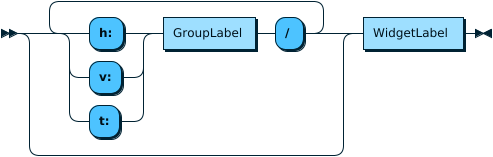

# Widget Modulation in Faust
## A Novel Extension for Audio Circuit Design
*By Yann Orlarey, Stephane Letz, Romain Michon and the Emeraude Team*

---

# Overview

- New extension to Faust programming language
- Inspired by modular synthesizers
- Enables "voltage control" style modulation
- Allows parameter modulation without code modification
- Enhances code reuse and customization

---

# Historical Context

- Mid-20th century: Voltage control in analog synthesis
- Key innovators:
  - Hugh Le Caine (VCO concept)
  - Robert Moog (1V/oct standard)
  - Don Buchla
- Enabled recursive control: signals controlling other signals
- Foundation for modern modular synthesis

---

# Traditional Approach in Faust

Basic oscillator example:
```faust
myosc = vslider("freq[style:knob][scale:log]", 
        440, 20, 20000, 0.1) 
      : os.osc;
```

Adding modulation required code modification:
```faust
myosc = +(vslider("freq[style:knob][scale:log]", 
        440, 20, 20000, 0.1)) 
      : os.osc;
```

---

# Freeverb Interface Example


Example modulation:
```faust
["Wet" -> dm.freeverb_demo]
```

---

# Widget Modulation: Basic Syntax

```faust
["WidgetName" -> Circuit]
```

Creates additional input for modulation signal
Default operation: multiplication

Syntax diagram:


---

# Target Syntax

Diagram showing target structure:


Widget path structure:


---

# Modulation Types

Three possible configurations:

1. Binary Circuit (2→1)
   - Creates additional input
   - Example: `"Wet":+`

2. Unary Circuit (1→1)
   - No additional input
   - Example: `"Wet":*(lfo(10, 0.5))`

3. Constant Circuit (0→1)
   - Replaces widget
   - Example: `"Wet":0.75`

---

# Multiple Targets Example: Mixer

Simple mixer with modulated gains:
```faust
["gain" -> mixer]
```


Specific channel modulation:
```faust
["v:chan 1/gain" -> mixer]
```


---

# Frequency Modulation Examples

Simple FM setup:


Enhanced FM with higher modulation:


---

# Complex Modulation Structure

Double modulation implementation:


```faust
["freq":md.add(-600,600), 
 "freq":md.mul(0.1,10) -> osc(1)]
```

---

# Advanced Modulation Circuits

Common modulation functions:

```faust
// For positive modulation (0 to +1)
addp(v1,v2,w,m) = max(lo, min(hi, w + v))
  with {
    lo = lowest(w);
    hi = highest(w);
    v = v1+m*(v2-v1);
  };

// For audio signals (-1 to +1)
add(v1,v2,w,m) = addp(v1,v2,w,(m+1)/2);
```

---

# Complex Example

Combined modulations with feedback:
```faust
process = osc(0) : 
  ["gain":md.add(0,0.5) -> 
    (_ ,osc(1): 
      ["freq":md.add(-600,600), 
       "freq":md.mul(0.1,10) -> 
         osc(2)])~@(200) ]<: _,@(5000);
```

---

# Best Practices

- Use clear widget naming conventions
- Consider range limitations when designing modulations
- Leverage group hierarchies for precise targeting
- Document modulation expectations in library code
- Test edge cases with extreme modulation values

---

# Benefits & Impact

- Enhances code reusability
- Enables post-development customization
- Facilitates library development
- Matches modular synthesis workflow
- No performance overhead
- Maintains Faust's functional approach

---

# Questions?

Contact:
- GRAME-CNCM
- INRIA/INSA
- emeraude@inria.fr

References:
- Bjørn & Meyer: "Patch & Tweak"
- de Wilde: "Les fous du son"
- Chowning: "The Synthesis of Complex Audio Spectra"
